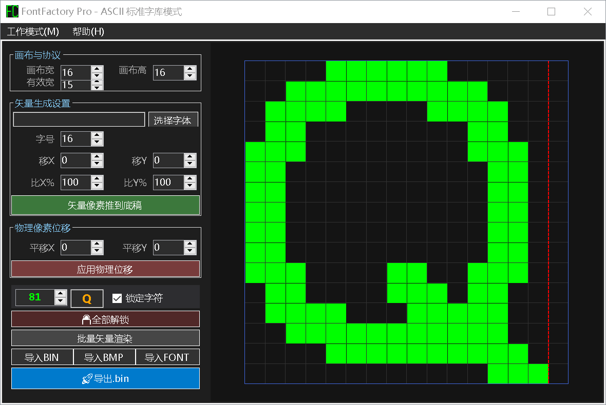
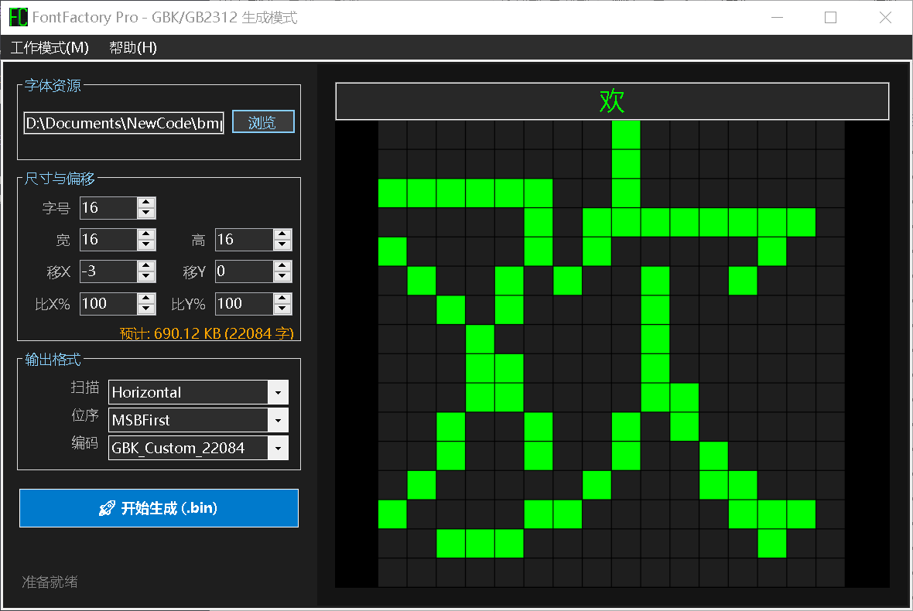
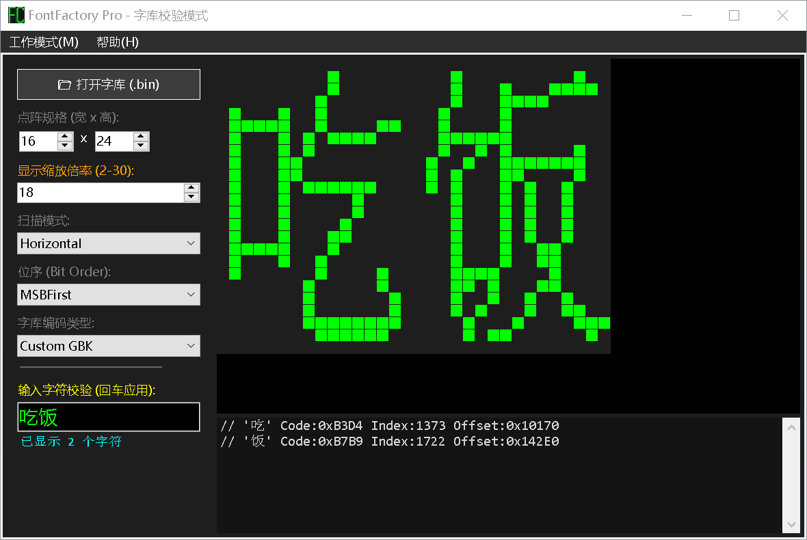

## 🚀 快速开始

### 1. 字体选择 (开发者警告 ⚠️)

由于 Windows 系统保护机制，**请勿直接在浏览窗口进入 `C:\Windows\Fonts` 目录选择文件**。

* **正确操作**：将你心仪的字体文件（如老版 `simsun.ttf`）复制到非系统文件夹后再进行选择。
* *如果不听劝，点击“打开”没反应就是系统对你的惩罚。*

### 2. 参数设置

* 左侧固定宽度面板用于设置字号、偏移及编码。

### 3. 生成与集成

* 点击生成 `.bin`。
* 参考“帮助”页面里的 `GetIndexByCode` 算法实现单片机侧的寻址函数。
